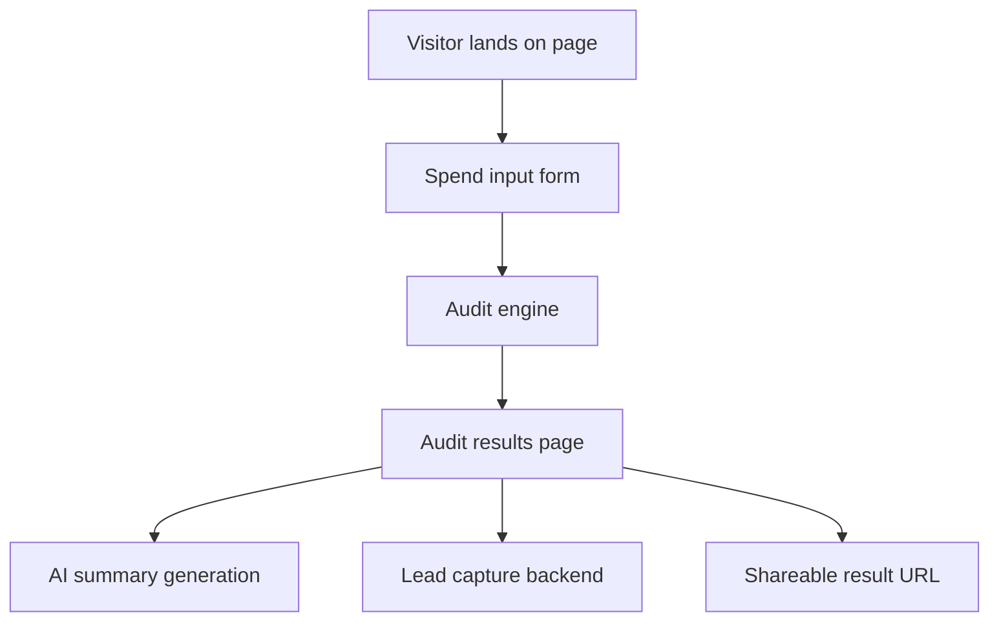

# Architecture

## System diagram

## Data flow
1. Visitor enters tool subscriptions, plan, spend, seats, team size, and use case.
2. Form state persists in local storage across reloads.
3. Audit engine evaluates plan fit, cheaper alternatives, and savings.
4. Results page displays per-tool recommendations and total savings.
5. Optional email capture stores leads in a backend and sends a confirmation email.
6. A unique public result URL renders the audit without personal details.

## Stack choice
- Next.js for server-side rendering, static Open Graph support, and app routing.
- TypeScript for safer frontend logic.
- Tailwind CSS for fast UI development.

## Scalability
To handle 10k audits/day, I would add a serverless audit API, a managed database for results, and edge caching for shareable report pages.

## Current backend behavior
The current implementation uses an in-memory lead store in `src/lib/lead-store.ts` for demo purposes. In production, this should be replaced with a persistent database such as Supabase/Postgres and a transactional email service for confirmation emails.
